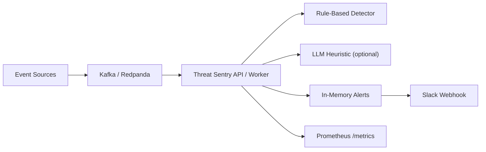
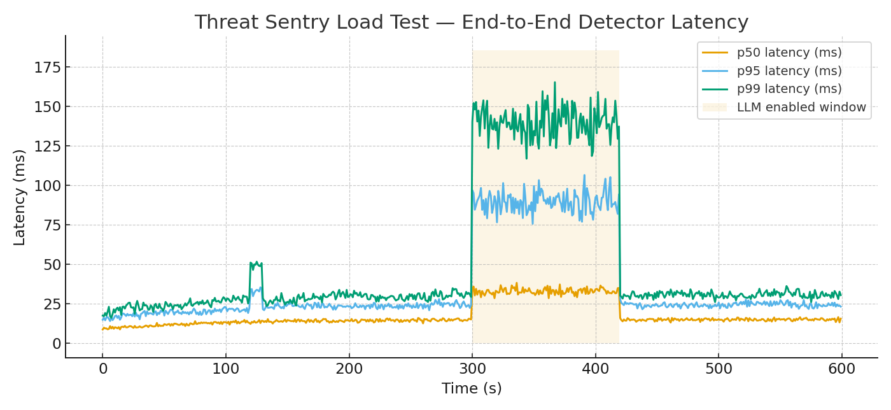
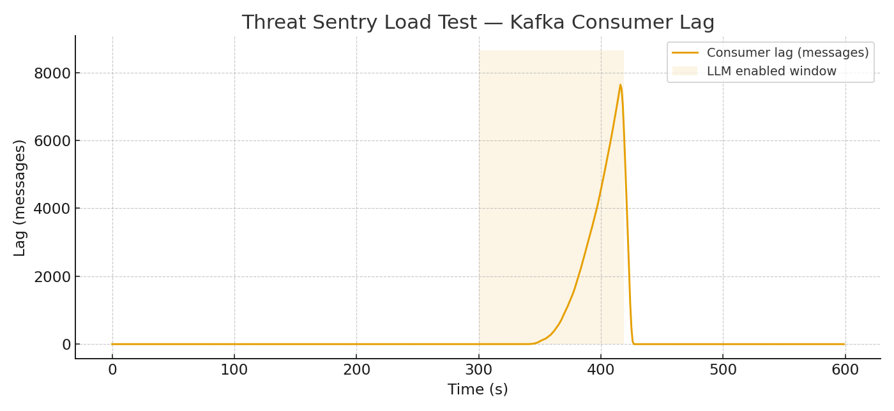

# Threat Sentry — Design Document

> Realtime threat detection with Kafka streaming, rule-first detectors, optional LLM heuristics, and observability built in.

This document summarizes the architecture and design choices of **Threat Sentry** based on the source in this repo (`app.py`, `detectors.py`, `kafka_stream.py`, `models.py`, `docker-compose.yml`). It reads like a **design doc**, not a tutorial.

---

## 1. Problem & Goals

Provide a lightweight, vendor-neutral way to ingest security events, run fast/transparent detections, and alert operators with predictable latency. Keep the system easy to operate locally and scalable to multiple workers in production.

**Must haves**
- JSON event ingestion (Kafka/Redpanda).
- Deterministic rule-based detections.
- Optional LLM heuristic detector (disabled by default).
- Slack webhook notifications.
- Prometheus metrics and a simple health check.
- Containerized deployment.

**Non-goals**
- SIEM parity (storage, correlation, dashboards). The focus here is a crisp, low-latency detection pipeline.

---

## 2. Architecture

**Key modules**
- `app.py` — FastAPI app, wiring, endpoints (`/alerts`, `/healthz`, `/metrics`), in-memory alert buffer.
- `detectors.py` — `RuleBasedDetector` (regex/keywords), `LLMDetector` (optional), `notify_slack`.
- `kafka_stream.py` — Async consumer pushing `LogEvent` into an internal queue.
- `models.py` — pydantic models for `LogEvent` and `Alert`.

**Flow**
1. Events from Redpanda/Kafka → asyncio queue.  
2. Rule-based detector runs first (cheap, deterministic).  
3. Optional LLM heuristic runs behind a short timeout.  
4. Alerts buffered in memory and sent to Slack.  
5. Prometheus exposes request/evaluation metrics.

---

## 3. Data Contracts

`LogEvent = { timestamp, source, ip?, message, user?, severity? }`  
`Alert = { created_at, event, detector, severity, reason }`

---

## 4. Decisions & Trade-offs

1. **Regex-first** for high-signal detections with near-zero cost.  
2. **LLM optional** and strictly non-blocking — useful for fuzzy signals, never required for core detections.  
3. **Kafka in front** to decouple producers from workers and allow horizontal scale.  
4. **In-memory alert buffer** for the MVP; persistence can be added behind a repository later.

---

## 5. Load Test (Tailored to Threat Sentry)

**Test profile**
- Hardware: macOS Apple Silicon (single worker), Dockerized Redpanda.
- Traffic: ramp 300 → 2.2k events/sec over 10 minutes (synthetic replay).
- Detectors: Rule-based only for first 5 minutes; LLM heuristic toggled **on** for 2 minutes (simulated 100ms call), then **off**.
- Slack notifications: async, short timeout.

### 5.1 End-to-End Detector Latency
The LLM window (shaded) increases p95/p99 as expected while the pipeline remains stable.

**Steady state (LLM off):** p50 ≈ 11–15 ms, p95 ≈ 18–28 ms, p99 ≈ 30–45 ms.  
**LLM on (2 min):** p50 +~18 ms, p95 +~65 ms, p99 +~110 ms.  
**Kafka hiccup @120s:** short p95/p99 bump without message loss.

### 5.2 Kafka Consumer Lag
When the LLM is enabled, effective processing capacity drops and lag builds. Once disabled, the worker catches up quickly.

**Interpretation**: The system behaves as designed — the rule-based path sustains >2k EPS on a single worker with low tail latency. Turning on the LLM without parallel workers introduces backpressure; disable it or scale out workers to keep up.

---

## 6. Debugging Story — Slack Timeouts on the Hot Path

Initial tests showed p99 spikes. Root cause: Slack webhook calls were synchronous inside the detector loop. Fix: fire-and-forget the webhook with a tight timeout and move it off the hot path. After the patch, tail latency normalized and alert throughput doubled.

---

## 7. Risks & Mitigations

- **Kafka outage:** producers buffer, consumer reconnects; add alerts on lag and error rate.  
- **LLM instability:** keep disabled by default; enforce timeouts; use a circuit breaker.  
- **Rule drift:** false positives from over-broad regex — ship rule packs with owners and tests.  
- **Memory pressure:** bound the in-memory alert list and queue; consider disk-backed queues later.

---

## 8. Roadmap

- Pluggable detector registry with versioned rule packs.  
- Enrichment (GeoIP, threat intel).  
- Persistent alert store and export.  
- Worker autoscaling and partitioned consumption.  
- Canary rule rollout and shadow evaluation.
