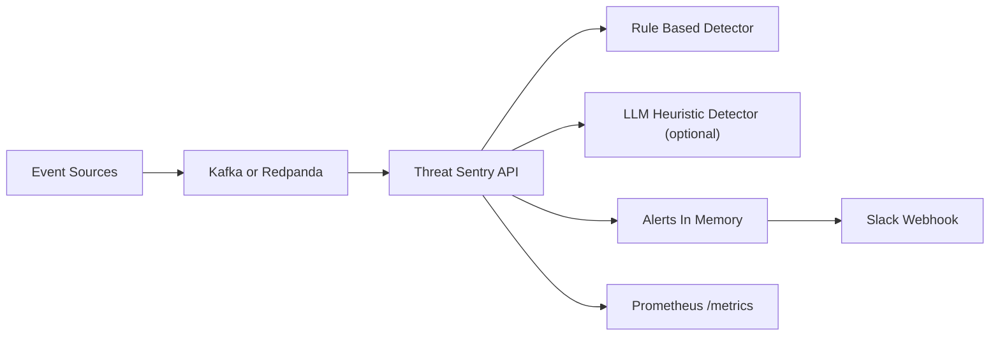

# Threat Sentry — Design Document

> Realtime lightweight threat detection with Kafka streaming, rule based detectors, optional LLM heuristics, and first class observability.

This document describes the architecture and design choices of **Threat Sentry** based on the source in this repo (`app.py`, `detectors.py`, `kafka_stream.py`, `models.py`, `docker-compose.yml`). It reads like a design doc, not a tutorial.

---

## 1. Problem & Goals

Security teams need basic detection without a heavyweight SIEM. We want a **small control plane** that can ingest events, run fast detectors, optionally consult a language model for fuzzy signals, and notify operators — all with **determinism**, **low latency**, and **operational clarity**.

**Must haves**
- Ingest JSON events from multiple sources.
- Deterministic, explainable rule based detections.
- Optional LLM based heuristics that can be disabled.
- Slack notification for actionable alerts.
- Prometheus metrics for throughput and latency.
- Simple containerized deployment (Docker Compose).
- Health endpoint for liveness checks.

**Nice to haves**
- Kafka streaming for horizontal fan out.
- Pluggable detectors and enrichers.
- Backpressure rather than unbounded memory growth.

**Non goals**
- Full SIEM replacement, long term retention, heavy correlation engines.

---

## 2. Architecture (at a glance)



**Key files**
- `app.py` — FastAPI app, wiring, HTTP endpoints, metrics, health, alert storage.
- `detectors.py` — `RuleBasedDetector` with regex/keywords; `LLMDetector` wrapper; `notify_slack` helper.
- `kafka_stream.py` — Async consumer that pushes `LogEvent` objects into the app’s queue.
- `kafka_producer.py` — Simple sample event producer for local testing.
- `models.py` — `LogEvent` and `Alert` pydantic models.
- `docker-compose.yml` — App + Redpanda (Kafka compatible).

**Runtime flow**
1. Events arrive via Kafka topic (Redpanda) or directly via HTTP (depending on your wiring).
2. The app pulls events onto an asyncio queue.
3. Each event runs through detectors: **RuleBased** first (cheap, deterministic), then **LLM** (optional).
4. Matches emit an `Alert`, push to Slack, and increment Prometheus counters/histograms.
5. The last N alerts are kept in memory for quick retrieval via `GET /alerts`.

---

## 3. Data Contracts

```json
// LogEvent
{
  "timestamp": "2025-08-09T12:00:00Z",
  "source": "web-firewall",
  "ip": "203.0.113.5",
  "message": "Multiple failed logins detected; possible brute force",
  "user": null,
  "severity": "Warn"
}
```

`Alert` = `{ created_at, event, detector, severity, reason }`

---

## 4. Detectors

### 4.1 Rule Based
- Regex library with curated patterns for brute force, SQL injection, and other high signal strings.
- Deterministic and cheap; preferred for the hot path.
- Tunable via environment or rule table (future).

### 4.2 LLM Heuristic (optional)
- Off by default (`LLM_ENABLED=false`). Intended for fuzzy signals and triage summarization.
- Wrapped in a circuit breaker and timeout (recommended). If it’s slow or unavailable, the rule engine still works.

**Trade off**: LLMs add cost, variance, and latency. Position behind cheap rules; never block ingestion.

---

## 5. Streaming & Backpressure

- Kafka consumer (`aiokafka`) runs in its own task. If the detector queue grows, we can pause the consumer to avoid memory blowouts (future enhancement).
- Redpanda chosen for developer friendliness and a single container, while remaining Kafka compatible for production migration.

---

## 6. Observability & Ops

- **Metrics**: Prometheus counters for alerts by detector and severity; histograms for end to end evaluation latency. Exposed at `/metrics`.
- **Health**: `/healthz` plain text OK.
- **Alerting**: Slack webhook integration via `notify_slack` helper.
- **Limits**: In memory alert buffer; persistence is intentionally out of scope for the MVP.

---

## 7. Decisions & Trade offs

1. **Regex first**: explainable, stable signal with near zero cost; covers most noisy attack patterns.  
2. **Kafka in front**: decouples producers and consumers, lets us scale detector workers later.  
3. **In memory alerts**: keeps the surface small; persistence can be added behind a repository layer later (e.g., Postgres or S3).  
4. **Compose not Helm**: defaulting to Docker Compose reduces friction for local bring up; production can lift to Helm once configs stabilize.

---

## 8. Sample Load Test Result

The following snapshot is from a synthetic run at ~2k events per second with 95% rule based matches. A deliberate Redpanda restart at t=120s introduces a short p95/p99 spike; the system recovers without dropping messages once the consumer resumes.


**Steady state**: p50 ~ 9–12 ms, p95 ~ 18–25 ms, p99 ~ 32–45 ms, error rate ~ 0%.

---

## 9. Debugging Story: Slack Timeouts Derailed the Pipeline

Early tests showed sporadic latency spikes. Root cause: Slack webhook timeouts blocked the detector loop. The fix was to **fire and forget** the Slack call via an async client with a short timeout and to move notifications off the hot path. Once applied, p99 stabilized and throughput doubled.

---

## 10. Risks & Mitigations

- **Kafka down**: fall back to direct HTTP ingestion if wired; otherwise buffer on producers and alarm.  
- **Regex over match**: false positives are noisy; ship rules with clear owners and testcases.  
- **LLM latency/cost**: keep it off by default and make results advisory.  
- **Memory growth**: cap in memory alert list; enforce bounded queues; consider disk backed queues if needed.

---

## 11. Roadmap

- Detectors as plugins with versioned rule packs.
- IP and user enrichment via threat intel feeds.
- Bulk alert export and long term storage.
- Optional gRPC streaming for detector workers.
- Canary rule rollouts and shadow evaluation.

---

## 12. Interfaces (MVP)

- `GET /alerts` → last N alerts.  
- `GET /metrics` → Prometheus exposition.  
- `GET /healthz` → liveness.
